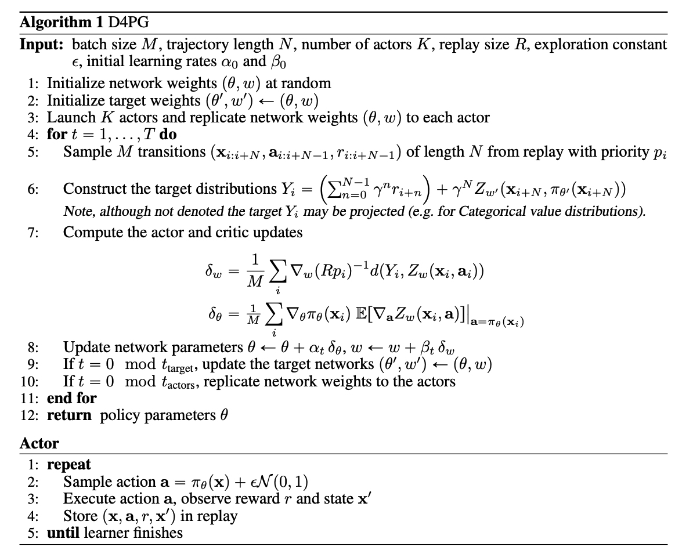
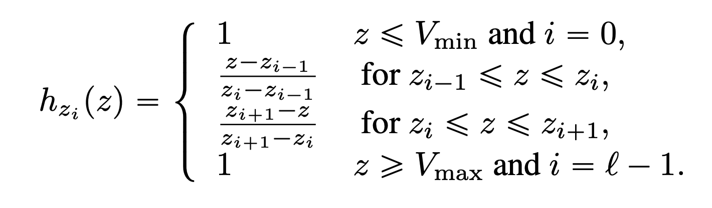
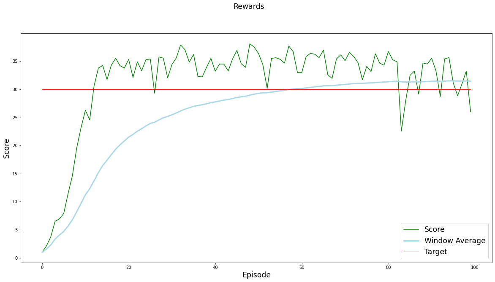
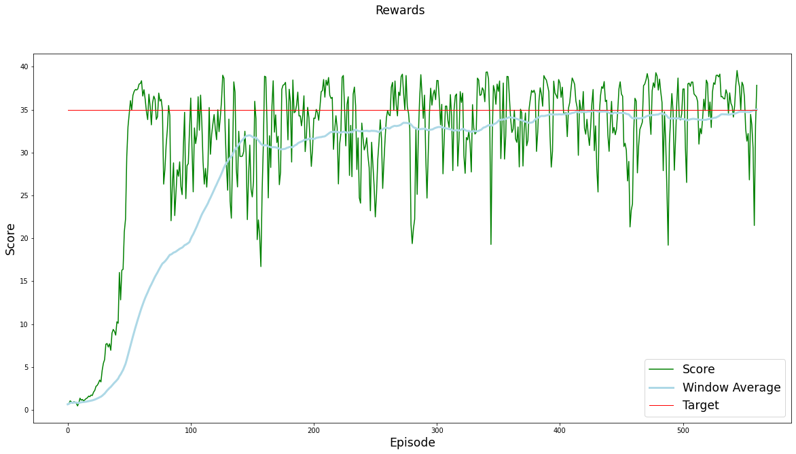
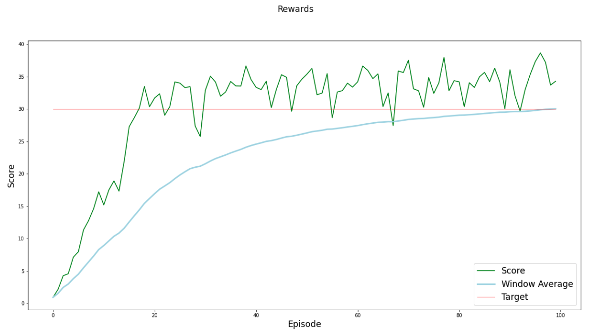
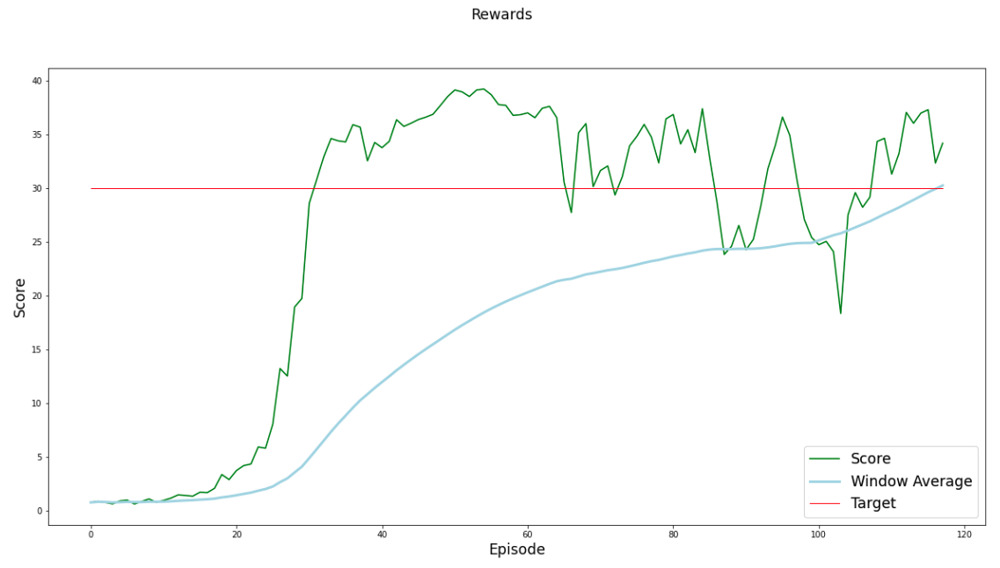
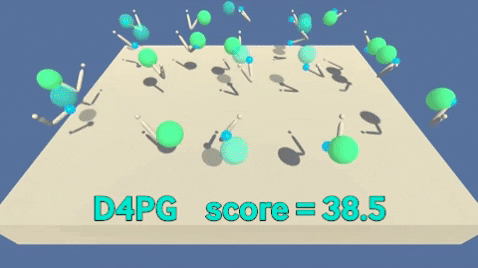
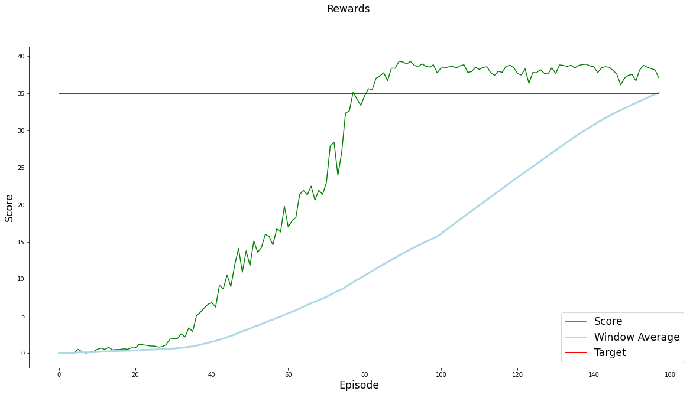
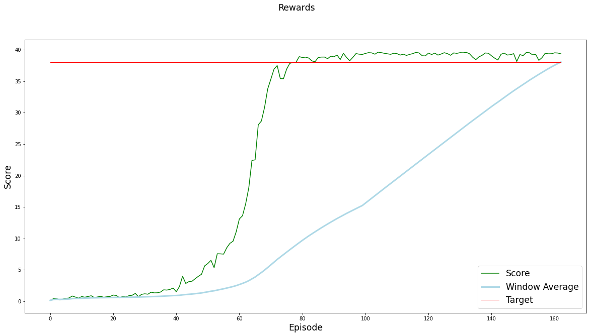

[//]: # (Image References)

[image1]: https://user-images.githubusercontent.com/10624937/43851024-320ba930-9aff-11e8-8493-ee547c6af349.gif "Trained Agent"
[image2]: https://user-images.githubusercontent.com/10624937/43851646-d899bf20-9b00-11e8-858c-29b5c2c94ccc.png "Crawler"


# Project 2: Continuous Control

### Introduction

For this project, you will work with the [Reacher](https://github.com/Unity-Technologies/ml-agents/blob/master/docs/Learning-Environment-Examples.md#reacher) environment.

![Trained Agent][image1]

In this environment, a double-jointed arm can move to target locations. A reward of +0.1 is provided for each step that the agent's hand is in the goal location. Thus, the goal of your agent is to maintain its position at the target location for as many time steps as possible.

The observation space consists of 33 variables corresponding to position, rotation, velocity, and angular velocities of the arm. Each action is a vector with four numbers, corresponding to torque applicable to two joints. Every entry in the action vector should be a number between -1 and 1.

### Distributed Training

For this project, we will provide you with two separate versions of the Unity environment:
- The first version contains a single agent.
- The second version contains 20 identical agents, each with its own copy of the environment.  

The second version is useful for algorithms like [PPO](https://arxiv.org/pdf/1707.06347.pdf), [A3C](https://arxiv.org/pdf/1602.01783.pdf), and [D4PG](https://openreview.net/pdf?id=SyZipzbCb) that use multiple (non-interacting, parallel) copies of the same agent to distribute the task of gathering experience.  

### Solving the Environment

Note that your project submission need only solve one of the two versions of the environment. 

#### Option 1: Solve the First Version

The task is episodic, and in order to solve the environment,  your agent must get an average score of +30 over 100 consecutive episodes.

#### Option 2: Solve the Second Version

The barrier for solving the second version of the environment is slightly different, to take into account the presence of many agents.  In particular, your agents must get an average score of +30 (over 100 consecutive episodes, and over all agents).  Specifically,
- After each episode, we add up the rewards that each agent received (without discounting), to get a score for each agent.  This yields 20 (potentially different) scores.  We then take the average of these 20 scores. 
- This yields an **average score** for each episode (where the average is over all 20 agents).

The environment is considered solved, when the average (over 100 episodes) of those average scores is at least +30. 

### Getting Started

1. Download the environment from one of the links below.  You need only select the environment that matches your operating system:

    - **_Version 1: One (1) Agent_**
        - Linux: [click here](https://s3-us-west-1.amazonaws.com/udacity-drlnd/P2/Reacher/one_agent/Reacher_Linux.zip)
        - Mac OSX: [click here](https://s3-us-west-1.amazonaws.com/udacity-drlnd/P2/Reacher/one_agent/Reacher.app.zip)
        - Windows (32-bit): [click here](https://s3-us-west-1.amazonaws.com/udacity-drlnd/P2/Reacher/one_agent/Reacher_Windows_x86.zip)
        - Windows (64-bit): [click here](https://s3-us-west-1.amazonaws.com/udacity-drlnd/P2/Reacher/one_agent/Reacher_Windows_x86_64.zip)

    - **_Version 2: Twenty (20) Agents_**
        - Linux: [click here](https://s3-us-west-1.amazonaws.com/udacity-drlnd/P2/Reacher/Reacher_Linux.zip)
        - Mac OSX: [click here](https://s3-us-west-1.amazonaws.com/udacity-drlnd/P2/Reacher/Reacher.app.zip)
        - Windows (32-bit): [click here](https://s3-us-west-1.amazonaws.com/udacity-drlnd/P2/Reacher/Reacher_Windows_x86.zip)
        - Windows (64-bit): [click here](https://s3-us-west-1.amazonaws.com/udacity-drlnd/P2/Reacher/Reacher_Windows_x86_64.zip)
    
    (_For Windows users_) Check out [this link](https://support.microsoft.com/en-us/help/827218/how-to-determine-whether-a-computer-is-running-a-32-bit-version-or-64) if you need help with determining if your computer is running a 32-bit version or 64-bit version of the Windows operating system.

    (_For AWS_) If you'd like to train the agent on AWS (and have not [enabled a virtual screen](https://github.com/Unity-Technologies/ml-agents/blob/master/docs/Training-on-Amazon-Web-Service.md)), then please use [this link](https://s3-us-west-1.amazonaws.com/udacity-drlnd/P2/Reacher/one_agent/Reacher_Linux_NoVis.zip) (version 1) or [this link](https://s3-us-west-1.amazonaws.com/udacity-drlnd/P2/Reacher/Reacher_Linux_NoVis.zip) (version 2) to obtain the "headless" version of the environment.  You will **not** be able to watch the agent without enabling a virtual screen, but you will be able to train the agent.  (_To watch the agent, you should follow the instructions to [enable a virtual screen](https://github.com/Unity-Technologies/ml-agents/blob/master/docs/Training-on-Amazon-Web-Service.md), and then download the environment for the **Linux** operating system above._)

2. Place the file in the DRLND GitHub repository, in the `p2_continuous-control/` folder, and unzip (or decompress) the file. 

### Instructions

Follow the instructions in `Continuous_Control.ipynb` to get started with training your own agent!  

### (Optional) Challenge: Crawler Environment

After you have successfully completed the project, you might like to solve the more difficult **Crawler** environment.

![Crawler][image2]

In this continuous control environment, the goal is to teach a creature with four legs to walk forward without falling.  

You can read more about this environment in the ML-Agents GitHub [here](https://github.com/Unity-Technologies/ml-agents/blob/master/docs/Learning-Environment-Examples.md#crawler).  To solve this harder task, you'll need to download a new Unity environment.  (**Note**: Udacity students should not submit a project with this new environment.)

You need only select the environment that matches your operating system:
- Linux: [click here](https://s3-us-west-1.amazonaws.com/udacity-drlnd/P2/Crawler/Crawler_Linux.zip)
- Mac OSX: [click here](https://s3-us-west-1.amazonaws.com/udacity-drlnd/P2/Crawler/Crawler.app.zip)
- Windows (32-bit): [click here](https://s3-us-west-1.amazonaws.com/udacity-drlnd/P2/Crawler/Crawler_Windows_x86.zip)
- Windows (64-bit): [click here](https://s3-us-west-1.amazonaws.com/udacity-drlnd/P2/Crawler/Crawler_Windows_x86_64.zip)

Then, place the file in the `p2_continuous-control/` folder in the DRLND GitHub repository, and unzip (or decompress) the file.  Next, open `Crawler.ipynb` and follow the instructions to learn how to use the Python API to control the agent.

(_For AWS_) If you'd like to train the agent on AWS (and have not [enabled a virtual screen](https://github.com/Unity-Technologies/ml-agents/blob/master/docs/Training-on-Amazon-Web-Service.md)), then please use [this link](https://s3-us-west-1.amazonaws.com/udacity-drlnd/P2/Crawler/Crawler_Linux_NoVis.zip) to obtain the "headless" version of the environment.  You will **not** be able to watch the agent without enabling a virtual screen, but you will be able to train the agent.  (_To watch the agent, you should follow the instructions to [enable a virtual screen](https://github.com/Unity-Technologies/ml-agents/blob/master/docs/Training-on-Amazon-Web-Service.md), and then download the environment for the **Linux** operating system above._)

### Algorithm 

The chosen environment to work on this project was the second version, which has 20 agents interacting with the environment. The agents share their experience in a common replay buffer favoring faster convergence. 

In order to allow the agent to learn, I coded two algorithms:
* DDPG
* D4PG

#### Environment Setup
* Reacher.app
* Number of agents: 20
* Number of actions: 4
* States have length: 33

#### DDPG

The current environment has a conitnuous action and state space. Due to this fact, a method that can handle this kind of environment is needed. The DDPG algorithm stands for Deep Deterministic Policy gradient. It was introduced by Lillicrap et al. and its aim is to adapt the DQN algorithm to a continuous domain. 

* It is an actor-critic method, which is arguably, that learns a policy from a low dimensional state. The actor in DDPG is used to approximate the optimal policy deterministically. It outputs the best action for any given state. 

* In DDPG, it is inferred the best action every single time when a query to the actor network is made. That is a deterministic policy. 

* The actor is basically learning the $argmax_a Q(s,a)$, which is the best action. 

* The critic learns to evaluate the optimal value function by using the actors best believed action. 

* The actor, which is an approximate maximizer, calculates a new target value for training the action value function, such as in DQN.

The model used for the actor and the critic is as follows:

```
def hidden_init(layer):
    fan_in = layer.weight.data.size()[0]
    lim = 1. / np.sqrt(fan_in)
    return (-lim, lim)

class DDPGActor(nn.Module):
    """Actor (Policy) Model."""

    def __init__(self, state_size, action_size, seed, fc1_units=400, fc2_units=300):
        """Initialize parameters and build model.
        Params
        ======
            state_size (int): Dimension of each state
            action_size (int): Dimension of each action
            seed (int): Random seed
            fc1_units (int): Number of nodes in first hidden layer
            fc2_units (int): Number of nodes in second hidden layer
        """
        super(DDPGActor, self).__init__()
        self.seed = torch.manual_seed(seed)
        self.fc1 = nn.Linear(state_size, fc1_units)
        self.fc2 = nn.Linear(fc1_units, fc2_units)
        self.fc3 = nn.Linear(fc2_units, action_size)
        self.reset_parameters()

    def reset_parameters(self):
        self.fc1.weight.data.uniform_(*hidden_init(self.fc1))
        self.fc2.weight.data.uniform_(*hidden_init(self.fc2))
        self.fc3.weight.data.uniform_(-3e-3, 3e-3)

    def forward(self, state):
        """Build an actor (policy) network that maps states -> actions."""
        x = F.relu(self.fc1(state))
        x = F.relu(self.fc2(x))
        return F.tanh(self.fc3(x))

class DDPGCritic(nn.Module):
    """Critic (Value) Model."""

    def __init__(self, state_size, action_size, seed, fcs1_units=400, fc2_units=300):
        """Initialize parameters and build model.
        Params
        ======
            state_size (int): Dimension of each state
            action_size (int): Dimension of each action
            seed (int): Random seed
            fcs1_units (int): Number of nodes in the first hidden layer
            fc2_units (int): Number of nodes in the second hidden layer
        """
        super(DDPGCritic, self).__init__()
        self.seed = torch.manual_seed(seed)
        self.fcs1 = nn.Linear(state_size, fcs1_units)
        self.fc2 = nn.Linear(fcs1_units+action_size, fc2_units)
        self.fc3 = nn.Linear(fc2_units, 1)
        self.reset_parameters()
        self.bn = nn.BatchNorm1d(fcs1_units)

    def reset_parameters(self):
        self.fcs1.weight.data.uniform_(*hidden_init(self.fcs1))
        self.fc2.weight.data.uniform_(*hidden_init(self.fc2))
        self.fc3.weight.data.uniform_(-3e-3, 3e-3)

    def forward(self, state, action):
        """Build a critic (value) network that maps (state, action) pairs -> Q-values."""
        xs = self.fcs1(state)
        xs = F.relu(self.bn(xs))
        x = torch.cat((xs, action), dim=1)
        x = F.relu(self.fc2(x))
        return torch.sigmoid(self.fc3(x))
```

The learning update is given by the following code:

```
states, actions, rewards, next_states, dones = experiences

# ---------------------------- update critic ---------------------------- #
# Get predicted next-state actions and Q values from target models
actions_next = self.actor_target(next_states)
Q_targets_next = self.critic_target(next_states, actions_next)
# Compute Q targets for current states (y_i)
Q_targets = rewards + (gamma * Q_targets_next * (1 - dones))
# Compute critic loss
Q_expected = self.critic_local(states, actions)
critic_loss = F.mse_loss(Q_expected, Q_targets)
# Minimize the loss
self.critic_optimizer.zero_grad()
critic_loss.backward()
torch.nn.utils.clip_grad_norm(self.critic_local.parameters(), 1)
self.critic_optimizer.step()

# ---------------------------- update actor ---------------------------- #
# Compute actor loss
actions_pred = self.actor_local(states)
actor_loss = -self.critic_local(states, actions_pred).mean()
# Minimize the loss
self.actor_optimizer.zero_grad()
actor_loss.backward()
self.actor_optimizer.step()

# ----------------------- update target networks ----------------------- #
self.soft_update(self.critic_local, self.critic_target, TAU)
self.soft_update(self.actor_local, self.actor_target, TAU)                
```


#### D4PG

[Distributed Distributional Deep Deterministic Policy Gradients](https://arxiv.org/pdf/1804.08617.pdf) was introduced by Marth-Maron et al. in 2018. Their work adopts a distributional perspective on Reinforcement Learning for continuous control. 

DQN shows a poor performance in continous tasks due to the optimization cost of every step or the discretiztion of the action space.

D4PG takes the DDPG algorithn as a base and makes some enhancements.

* The return is considered as a random variable.

* The critic, instead of returning a single value, returns N_ATOMS values that corresponds to the probabilities of values from the pre-defined range. So, we have a distributed critic.

* D4PG uses cross-entropy loss to compare the output of the critic and the Bellman operator.



One important fact is the projection. The target is projected according to the categorical projection of Bellemare et al. by the following equation:



```
### This code is refered from Deep Reinforcement Learning Hands On 
# https://github.com/PacktPublishing/Deep-Reinforcement-Learning-Hands-On
class D4PGActor(nn.Module):
    def __init__(self, state_size, action_size, seed, fc1_units=400, fc2_units=300):
        super(D4PGActor, self).__init__()

        self.net = nn.Sequential(
            nn.Linear(state_size, fc1_units),
            nn.ReLU(),
            nn.Linear(fc1_units, fc2_units),
            nn.ReLU(),
            nn.Linear(fc2_units, action_size),
            nn.Tanh()
        )

    def forward(self, x):
        return self.net(x)

class D4PGCritic(nn.Module):
    def __init__(self, state_size, action_size, seed, fc1_units=400, fc2_units=300, n_atoms=51, v_min=-10, v_max=10):
        super(D4PGCritic, self).__init__()

        self.obs_net = nn.Sequential(
            nn.Linear(state_size, fc1_units),
            nn.ReLU(),
        )

        self.out_net = nn.Sequential(
            nn.Linear(fc1_units + action_size, fc2_units),
            nn.ReLU(),
            nn.Linear(fc2_units, n_atoms)
        )
        delta = (v_max - v_min) / (n_atoms - 1)

        self.register_buffer("supports", torch.arange(v_min, v_max + delta, delta))

    def forward(self, x, a):
        x = self.obs_net(x)
        return self.out_net(torch.cat([x, a], dim=1))

    def distr_to_q(self, distr):
        weights = F.softmax(distr, dim=1) * self.supports
        res = weights.sum(dim=1)
        return res.unsqueeze(dim=-1)
```

The learning update is given by the following code:

```
states, actions, rewards, next_states, dones = experiences

# ---------------------------- update critic ---------------------------- #
critic_value_distribution = self.critic_local(states, actions) # Critic value distribution according to N_ATOMS
actions_next = self.actor_target(next_states)
distribution_values = self.critic_target(next_states, actions_next)
distribution_next = F.softmax(distribution_values, dim=1) # Compute softmax funciton along rows 

projected_distribution = categorical_distribution_projection(distribution_next, rewards, dones, gamma**REWARD_STEPS)

probability_distribution = -F.log_softmax(critic_value_distribution, dim=1) * projected_distribution
# Compute critic loss
critic_loss = probability_distribution.sum(dim=1).mean()

# Minimize the loss
self.critic_optimizer.zero_grad()
critic_loss.backward()
torch.nn.utils.clip_grad_norm(self.critic_local.parameters(), 1) # Clip gradient
self.critic_optimizer.step()

# ---------------------------- update actor ---------------------------- #
# Compute actor loss
actions = self.actor_local(states)
critic_value_distribution = self.critic_local(states, actions) # Critic value distribution according to N_ATOMS
actor_loss = -self.critic_local.distr_to_q(critic_value_distribution)
actor_loss = actor_loss.mean()

# Minimize the loss
self.actor_optimizer.zero_grad()
actor_loss.backward()
self.actor_optimizer.step()

# ----------------------- update target networks ----------------------- #

self.soft_update(self.critic_local, self.critic_target, TAU)
self.soft_update(self.actor_local, self.actor_target, TAU)  
```

### Results
#### DDPG

* To train the agent, run the cells in section 4 of the [Continous Control notebook](./Continuous_Control.ipynb).
* Choose the agent to be the DDPG_Agent.

##### First attempt
```
TARGET = 30
LEARN_EVERY_STEPS = 1
UPDATE_RATE = 20
BATCH_SIZE: 128
BUFFER_SIZE: 100000
GAMMA: 0.99
LR_ACTOR: 0.001          
LR_CRITIC: 0.001
TAU: 0.001
solved in: 0 episodes 
training time: 03h07m17s         
```
checkpoint_name = checkpoint_learning.pt


* I chose the learning rate of the actor and critic to be the same 1e-3.
* One can see that there is still a lot of variance in each arm.
* There are some states where the arm movement becomes unstable and gets crazy.
* Training took a lot of time.



##### Second attempt
```
TARGET = 35
LEARN_EVERY_STEPS = 1
UPDATE_RATE = 20
BATCH_SIZE: 128
BUFFER_SIZE: 100000
GAMMA: 0.99
LR_ACTOR: 0.001          
LR_CRITIC: 0.001
TAU: 0.001
solved in: 461 episodes 
training time: 03h08m20s        
```
checkpoint_name = checkpoint_norm.pt

* I increased the target score to 35.
* Variance increased when training. 
* There are still some states when the arm doesn't know how to act.
* There are not smooth transitions from one state to another.
* Training took a lot of time.




##### Third attempt
```
TARGET = 30
LEARN_EVERY_STEPS = 1
UPDATE_RATE = 20
BATCH_SIZE: 128
BUFFER_SIZE: 100000
GAMMA: 0.99
LR_ACTOR: 0.001          
LR_CRITIC: 0.001
TAU: 0.001
solved in: 0 episodes
training time: 03h10m54s
```
checkpoint_name = checkpoint_128_128.pt

* I  changed the two hidden layer size of the critic from 400 and 300 to 128 for both layers.
* The average score of evaluation is the highest until now.




##### Forth attempt
```
TARGET = 30
LEARN_EVERY_STEPS = 2
UPDATE_RATE = 1
BATCH_SIZE: 128
BUFFER_SIZE: 100000
GAMMA: 0.99
LR_ACTOR: 0.001          
LR_CRITIC: 0.0001
TAU: 0.001
solved in: 18 episodes          
training time: 00h32m42s
```

checkpoint_name = checkpoint_2_1.pt


* Training time was much more faster in comparison with the previous attempts. Instead of hours of training, it just took 30 mints getting similar results.



#### D4PG
* To train the agent, run the cells in section 4 of the [Continous Control notebook](./Continuous_Control.ipynb).
* Choose the agent to be the D4PG_Agent.
##### First attempt 
```
TARGET = 35
BUFFER_SIZE = int(1e5)  # replay buffer size
BATCH_SIZE = 128        # minibatch size
GAMMA = 0.99            # discount factor
TAU = 1e-3              # for soft update of target parameters
LR_ACTOR = 1e-3         # learning rate of the actor 
LR_CRITIC = 1e-3       # learning rate of the critic
WEIGHT_DECAY = 0
NOISE_EPSILON = 1      
NOISE_DECAY = 0.999
REWARD_STEPS = 5
LEARN_EVERY_STEPS = 1
UPDATE_RATE = 1
Vmax = 10
Vmin = -10
N_ATOMS = 51
DELTA_Z = (Vmax - Vmin) / (N_ATOMS - 1)
solved in: 58 episodes          
training time: 01h12m08s
```

checkpoint_name = checkpoint_d4pg_35.pt



* Learning stage is more stable than DDPG.
* Variance was reduced significantly.
* Agent performs very well in evaluation achiving a high score of 38.5.



##### Second attempt 
```
TARGET = 35
BUFFER_SIZE = int(1e5)  # replay buffer size
BATCH_SIZE = 128        # minibatch size
GAMMA = 0.99            # discount factor
TAU = 1e-3              # for soft update of target parameters
LR_ACTOR = 1e-3         # learning rate of the actor 
LR_CRITIC = 1e-3       # learning rate of the critic
WEIGHT_DECAY = 0
NOISE_EPSILON = 1      
NOISE_DECAY = 0.999
REWARD_STEPS = 5
LEARN_EVERY_STEPS = 1
UPDATE_RATE = 1
Vmax = 10
Vmin = -10
N_ATOMS = 51
DELTA_Z = (Vmax - Vmin) / (N_ATOMS - 1)
solved in: 63 episodes          
training time: 03h53m10s
```

checkpoint_name = checkpoint_d4pg_38.pt


* Compared with the previous attempt, a higher target allowed the agent to interact more with the environment and stabilize the score in a high value. Variance is also reduced.

* Agent's average score is 39.33.




### Evaluation

* To evaluate the agent in the environment, run the cells in section 5 of the [Navigation notebook](./Navigation.ipynb).

* Load the desired checkpoint.


### Conclusions

* Both methods were able to solve the environment.
* D4PG took more episodes for convergence than DDPG.
* D4PG got a higher average reward, around 39.33.

### Ideas for improvement

* Prioritize experience replay should be an interesting approach to compare with. Due to the update rate, some rare states are never used for training. 

*  In the DDPG algorithm, I updated the weigths of the actor and critic networks 20 times each timestep. So, a less agressive number of updates like 10 per timestep should allow the agent to get more feedback of the current model before updating.

* In the D4PG, I trained the network with the adviced hyperparameters given by Maxim Lapan in his book [Deep Reinforcement Learning - Hands on](https://github.com/PacktPublishing/Deep-Reinforcement-Learning-Hands-On). I got great results so I didn't fine tune the hyperparameters. Fine tunning the hyperparameters for this environment is a next step. 

* "Benchmarking Deep Reinforcement Learning for Continuous Control" by Duan et al. states that Trust Region Policy Optimization (TRPO) and Truncated Natural Policy Gradient (TNPG) should achieve better performance. 

* Implement Proximal Policy Optimization (PPO), which has also demonstrated good performance with continuous control tasks.


